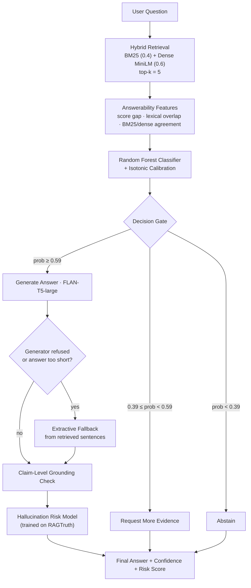

# AURA-RAG_Hallucination_Evaluation_System

<div align="center">


<br/>

***AURA-RAG is a retrieval-augmented QA system that gates its own answers —***  
***combining hybrid retrieval, a calibrated answerability classifier, grounded generation, and a RAGTruth-trained hallucination-risk model on real enterprise tech-support data (IBM TechQA).***

</div>

---
Most RAG demos only show off the happy path: a good question, good chunks, a fluent answer. This project asks the harder question — ***what should a RAG pipeline do when it can't answer well?***

- It builds a full pipeline that:

1. Retrieves evidence with a **hybrid BM25 + dense-embedding** retriever over a chunked corpus of real IBM technical support documents.
2. Learns to predict answerability from retrieval signals (score gaps, lexical overlap, BM25/dense agreement) using a calibrated Random Forest, then uses a **tuned 3-way decision gate** — `answer` / `request_more_evidence` / `abstain`.
3. Generates grounded answers with **FLAN-T5-large**, with an extractive fallback when the generator itself tries to refuse.
4. Scores **claim-level groundedness** of every generated sentence against the retrieved context, and estimates hallucination risk with a second classifier trained on the external **RAGTruth** benchmark.
5. Evaluates everything with ROUGE-L, BERTScore, an LLM-as-judge rubric, calibration diagnostics (ECE/Brier), and a **gating-policy ablation study**.
   
The headline result: **a "no gate, always answer" baseline produces unsafe answers 100% of the time on unanswerable questions (and a 90% unsupported-claim rate)**. The learned answerability gate brings that down to **~17–20%**, at the cost of answering fewer truly-answerable questions. The README below walks through exactly how, and how well.

---

## 🔍 Why This Exists

Production RAG systems fail in a specific, expensive way: they answer **confidently** when the retrieved evidence doesn't actually support an answer. This notebook treats that failure mode as the primary thing to measure and engineer against, organized around three connected questions:

| Question | Component |
|---|---|
| **Answerability** — does the system have enough evidence to answer at all? | Hybrid retrieval + calibrated Random Forest gate |
| **Reliability** — can we trust the gate's confidence score? | Isotonic calibration, reliability diagrams, ECE/Brier score |
| **Hallucination** — if it answers, is every claim actually grounded? | Sentence-embedding claim support + RAGTruth-trained risk classifier |

---

## 🏗️ Pipeline Architecture



---

## 🗂️ Datasets

| Dataset | Role | Size |
|---|---|---|
| **[`nvidia/TechQA-RAG-Eval`](https://huggingface.co/datasets/nvidia/TechQA-RAG-Eval)** | Primary QA benchmark — real IBM tech-support questions, many genuinely unanswerable from the provided docs | 910 examples → 610 answerable / 300 unanswerable |
| **Derived document corpus** | Chunked source documents used for retrieval | 1,379 chunks from 496 unique IBM support documents (360-word chunks, 80-word overlap) |
| **[RAGTruth](https://github.com/ParticleMedia/RAGTruth)** | External hallucination-labeled corpus, used only to train the auxiliary hallucination-risk classifier | 17,790 responses → 5,934 QA-task responses (29.1% contain a labeled hallucination) |

**Train / Validation / Test split** (stratified by answerability):

| Split | Examples | Answerable | Unanswerable |
|---|---|---|---|
| Train | 637 | 427 | 210 |
| Validation | 136 | 91 | 45 |
| Test | 137 | 92 | 45 |

Source documents are noisy real-world support technotes — the pipeline includes explicit cleanup for embedded base64/image blobs before chunking.

---

## 🧠 Methodology

### 1. Hybrid Retrieval
- **Sparse:** `BM25Okapi` over a custom tokenizer that preserves technical tokens (`ssl`, `v9.0`, file paths, etc.)
- **Dense:** `sentence-transformers/all-MiniLM-L6-v2` embeddings, cosine similarity
- **Fusion:** min-max normalized scores combined as `0.60 × dense + 0.40 × BM25`, top-k = 5

### 2. Answerability Gate
A `RandomForestClassifier` (400 trees) is trained on 13 retrieval-derived features per question — top/mean hybrid score, score gap and gap ratio, top/mean dense & BM25 scores, lexical overlap ratios, question length, and retrieved-context length. Raw probabilities are passed through **isotonic regression** fit on the validation set for calibration. The final decision threshold is **grid-searched on validation data** to maximize `F1 − 0.3·false_abstention_rate − 0.7·unsafe_rate`, subject to a hard cap of ≤20% unsafe-answer rate. This yields a 3-way policy:

```
prob_answerable ≥ 0.59           → answer
0.39 ≤ prob_answerable < 0.59    → request_more_evidence
prob_answerable < 0.39           → abstain
```

### 3. Grounded Generation
`google/flan-t5-large` generates from a strict instruction prompt (beam search, repetition penalty, explicit refusal string). If the model still refuses or produces a near-empty answer despite the gate saying "answer," an **extractive fallback** selects the best-overlapping sentences directly from retrieved chunks — keeping the system from silently failing when generation underperforms the gate.

### 4. Claim-Level Grounding + Hallucination Risk
Every generated answer is split into sentences ("claims"). Each claim is embedded and matched (max cosine similarity) against ~700-character context chunks; claims below a 0.42 similarity threshold are flagged **unsupported**. Separately, a small `RandomForestClassifier` is trained on **RAGTruth** (response length, context length, token overlap, sentence count, digit count) to produce a general-purpose hallucination-risk score that is attached to every final answer.

### 5. Evaluation Suite
- Retrieval recall@5
- Classifier accuracy / AUROC / precision / recall / F1 (raw + calibrated)
- End-to-end decision accuracy, unsafe-answer rate, false-abstention rate
- ROUGE-L and **BERTScore** (DeBERTa-MNLI) on genuinely-answered questions
- **LLM-as-judge** (FLAN-T5 itself, graded A–E across 4 rubric dimensions)
- Calibration: reliability diagram, Brier score, Expected Calibration Error
- **Gating-policy ablation** across 5 variants

---

## 📈 Results

> Numbers below are computed on the held-out **test split** (137 examples; system-level metrics sampled at n=80 for compute budget) unless noted.

### Retrieval

| Split | Recall@5 |
|---|---|
| Validation | 0.868 |
| Test | **0.946** |


Hybrid retrieval finds at least one gold document in the top-5 for ~95% of answerable test questions — the bottleneck downstream is *deciding what to do with that evidence*, not finding it.

### Answerability Classifier

| Split | Accuracy | AUROC | Precision | Recall | F1 |
|---|---|---|---|---|---|
| Validation | 0.735 | 0.827 | 0.796 | 0.813 | 0.804 |
| Test | 0.672 | **0.764** | 0.777 | 0.717 | 0.746 |

<p>


</p>

### Calibration

| | Brier Score ↓ | ECE ↓ |
|---|---|---|
| Raw probabilities | 0.1824 | 0.0994 |
| Isotonic-calibrated | 0.1822 | **0.0903** |


Isotonic calibration tightens the reliability curve (~9% relative ECE improvement) without materially changing the Brier score — the model's *ranking* of confident vs. uncertain questions was already decent; calibration mainly fixes the mapping from score to probability.

### End-to-End System (Test, n=80 sample)

| Metric | Value |
|---|---|
| Decision accuracy (should-answer vs. should-not) | 0.675 |
| **Unsafe answer rate** (answered when it shouldn't have) | **0.167** |
| False abstention rate (didn't answer when it could have) | 0.420 |
| Mean ROUGE-L (on correctly-answered questions) | 0.137 |
| Mean unsupported-claim rate | 0.147 |

<p>


</p>

The system is deliberately **conservative**: it would rather ask for more evidence or abstain (42% false-abstention rate on answerable questions) than risk an unsafe answer. That trade-off is explicit and tunable — see the [ablation study](#ablation-does-the-gate-actually-help) below.

### Generation Quality

Mean **BERTScore F1: 0.581** (precision 0.540 / recall 0.645), computed only on the subset of test questions that were genuinely answerable *and* that the system chose to answer.


A useful (and humbling) diagnostic — **gate confidence is only weakly correlated with actual answer quality** (Pearson r = 0.220 between `prob_answerable` and BERTScore F1):


This is flagged explicitly in [Limitations](#limitations--future-work): the gate is good at deciding *whether* to answer, but its confidence shouldn't yet be read as a proxy for *how good* the answer will be.

### LLM-as-Judge

Using FLAN-T5-large itself as a judge (A–E rubric → 1–5 score) across 4 dimensions, 80/80 responses parsed successfully:

| Dimension | Mean Score (1–5) |
|---|---|
| Decision appropriateness | 3.71 |
| Factuality | 3.36 |
| Completeness | 3.59 |
| **Overall** | 3.36 |


> Caveat: the judge is the *same model family* used for generation, not an independent stronger model — treat these as directional, not authoritative (more in [Limitations](#limitations--future-work)).

### Hallucination Risk Model (trained on RAGTruth)

| | Precision | Recall | F1 | Support |
|---|---|---|---|---|
| No hallucination | 0.86 | 0.76 | 0.81 | 1,053 |
| Hallucination | 0.55 | 0.71 | 0.62 | 431 |
| **AUROC** | | | **0.812** | |


The risk model trades precision for recall on the minority (hallucination) class — appropriate for a *risk flag* that should err toward over-flagging rather than missing real hallucinations.

---

## 🔬 Ablation: Does the Gate Actually Help?

Five gating policies were compared on the same 30-question test sample:

| Variant | Decision Accuracy | Unsafe Answer Rate | False Abstention Rate | Mean ROUGE-L | Unsupported Claim Rate |
|---|---|---|---|---|---|
| Full policy (0.60 / 0.40) | 0.533 | 0.20 | 0.60 | 0.012 | 0.30 |
| Conservative gate (0.70 / 0.50) | 0.533 | 0.20 | 0.60 | 0.012 | 0.30 |
| Aggressive gate (0.50 / 0.30) | **0.767** | 0.40 | 0.15 | 0.006 | 0.60 |
| Binary gate (answer/abstain only) | 0.533 | 0.20 | 0.60 | 0.012 | 0.30 |
| **No gate (always answer)** | 0.667 | **1.00** | 0.00 | 0.008 | **0.90** |

<p>


</p>

This is the clearest result in the project: **remove the gate entirely and the system answers every unanswerable question** (100% unsafe rate) **and 9 in 10 generated claims become unsupported.** Every gated variant cuts unsafe answers to 15–40% and unsupported claims to 30–60%, at the cost of accuracy and/or higher abstention. The "aggressive" threshold setting gets the best raw decision accuracy but does so by tolerating a higher unsafe rate — a reminder that *accuracy alone is the wrong metric to optimize* for a system whose worst failure mode is confidently wrong answers.

---

## ✨ Key Takeaways

- **Retrieval is not the bottleneck.** Recall@5 is ~95% on test; the hard problem is deciding what to do with imperfect evidence.
- **A learned, calibrated gate meaningfully reduces unsafe answers** — from 100% (no gate) down to ~17–20% — but does so by trading away recall on truly-answerable questions (42% false-abstention rate). This is a tunable safety/coverage knob, not a fixed property.
- **Isotonic calibration measurably improves ECE** (~9% relative) with no calibration-accuracy trade-off, making the gate's probability outputs more trustworthy as actual probabilities.
- **Gate confidence ≠ answer quality.** The weak correlation (r=0.22) between answerability confidence and BERTScore means "the system is sure it can answer" and "the answer is good" are currently two different questions — calibrating one doesn't automatically calibrate the other.
- **A lightweight, RAGTruth-trained hallucination-risk model generalizes reasonably well** (AUROC 0.81) using only shallow lexical/structural features, suggesting hallucination risk has detectable surface-level signal even without deep semantic modeling.
- **Claim-level grounding and ablation results both point the same direction:** ungated generation is unsafe by default for this domain (real, often-unanswerable enterprise support questions); explicit gating is not optional polish, it's load-bearing.

---

## 🗄️ Repository / Notebook Structure

The project is currently a single, linearly-executed Jupyter notebook (originally run on Kaggle with 2× Tesla T4 GPUs):

```
answerability-relability-hallucination-using-rag.ipynb
├── Cells 1–3    Environment setup, GPU check, runtime configuration
├── Cells 4–7    Load TechQA-RAG-Eval, clean contexts, train/val/test split, build chunked corpus
├── Cells 8–10   BM25 index, dense embeddings, hybrid retrieval function + recall@k evaluation
├── Cells 11–13  Answerability feature extraction, Random Forest training, isotonic calibration,
│                 threshold tuning, 3-way decision policy
├── Cells 14–18  FLAN-T5 generation, prompt construction, extractive fallback,
│                 claim-level grounding, full system prediction function
├── Cells 19–20  End-to-end evaluation (ROUGE-L, decision metrics) + qualitative error inspection
├── Cells 21–24  RAGTruth loading, label-type analysis, hallucination-risk classifier,
│                 risk-scoring integration into the main pipeline
├── Cell 25      Single-question worked demo
├── Cells 26–27  Consolidated metrics matrix + visualization suite
├── Cell 28–29   BERTScore evaluation + gate-confidence-vs-quality correlation
├── Cell 30      LLM-as-judge evaluation (4 rubric dimensions)
├── Cell 31      Post-hoc calibration analysis (reliability diagram, ECE, Brier)
└── Cell 32      Gating-policy ablation study
```

`assets/` in this README contains exported chart images from the notebook's saved run.

---

## 🚀 Getting Started

### Requirements
- Python 3.12
- A CUDA GPU is **strongly recommended** (the notebook was run on 2× Tesla T4, 14.5GB each); FLAN-T5-large and DeBERTa-MNLI (for BERTScore) are both multi-GB models.

### Install

```bash
pip install -q datasets transformers accelerate sentence-transformers \
               rank_bm25 scikit-learn pandas numpy tqdm rouge-score
pip install -q seaborn matplotlib bert-score
```

### Run

1. Open `answerability-relability-hallucination-using-rag.ipynb` in Jupyter, Kaggle, or Colab.
2. Run cells top-to-bottom. `nvidia/TechQA-RAG-Eval` downloads automatically from the Hugging Face Hub; RAGTruth is fetched directly from its GitHub repo (Cell 21) — both require internet access.
3. For a quick smoke test before a full run, lower `MAX_EVAL_EXAMPLES` (Cell 3) and `JUDGE_N` / `ABLATION_N` (Cells 30, 32).
4. For faster, lower-quality iteration, swap `GEN_MODEL_NAME` to `google/flan-t5-base`.

---

## ⚙️ Configuration Reference

All key knobs live in **Cell 3** (Runtime Configuration):

| Parameter | Default | Purpose |
|---|---|---|
| `TOP_K` | 5 | Documents retrieved per query |
| `HYBRID_ALPHA` | 0.60 | Dense vs. BM25 weighting (higher = more dense) |
| `CHUNK_WORDS` / `CHUNK_OVERLAP` | 360 / 80 | Document chunking for retrieval |
| `PROMPT_CONTEXT_CHAR_BUDGET` | 6000 | Max context characters injected into the generation prompt |
| `GEN_MODEL_NAME` | `google/flan-t5-large` | Generator (swap to `flan-t5-base` for speed) |
| `EMBED_MODEL_NAME` | `sentence-transformers/all-MiniLM-L6-v2` | Dense embedder |
| `ANSWER_THRESHOLD` / `REQUEST_MORE_EVIDENCE_THRESHOLD` | tuned to 0.59 / 0.39 | 3-way decision gate (auto-tuned in Cell 13, these are just initial fallbacks) |
| `MAX_UNSAFE_RATE_FOR_GATE` | 0.20 | Hard safety constraint used during threshold tuning |

---

## 🚧 Limitations & Future Work

- **Self-judging risk:** the LLM-as-judge uses the *same* FLAN-T5-large model that generates the answers, not an independent or stronger evaluator — judge scores should be read as a rough internal consistency signal, not ground truth.
- **Small evaluation samples:** end-to-end and judge evaluations use n=80 test examples, and the ablation study uses n=30, for compute-budget reasons. Wider confidence intervals are expected; conclusions are directional rather than tightly bounded.
- **Shallow hallucination features:** the RAGTruth-trained risk classifier uses only lexical/structural features (length, token overlap, digit count) — no NLI or entailment modeling. It generalizes surprisingly well (AUROC 0.81) but likely misses subtler unsupported claims.
- **Gate confidence vs. quality gap:** as shown above, the answerability gate's confidence is only weakly predictive of final answer quality (r≈0.22). A natural next step is a learned answer-quality predictor, not just an answer/no-answer gate.
- **Single-domain corpus:** all retrieval and generation evaluation is on IBM enterprise support documents — the gate, thresholds, and calibration are unlikely to transfer as-is to other domains without re-tuning.
- **Next steps:** stronger/independent LLM judge, NLI-based claim verification, larger eval samples, domain-transfer experiments, and joint calibration of *both* answerability and answer-quality scores.

---

## 📚 Acknowledgments & Citations

- **TechQA-RAG-Eval** dataset — [`nvidia/TechQA-RAG-Eval`](https://huggingface.co/datasets/nvidia/TechQA-RAG-Eval) on Hugging Face.
- **RAGTruth** — [ParticleMedia/RAGTruth](https://github.com/ParticleMedia/RAGTruth), used here for training the auxiliary hallucination-risk classifier.
- **Models:** [`google/flan-t5-large`](https://huggingface.co/google/flan-t5-large), [`sentence-transformers/all-MiniLM-L6-v2`](https://huggingface.co/sentence-transformers/all-MiniLM-L6-v2), [`microsoft/deberta-base-mnli`](https://huggingface.co/microsoft/deberta-base-mnli) (BERTScore backbone).
- Built with 🤗 Transformers, Sentence-Transformers, `rank_bm25`, scikit-learn, `rouge-score`, `bert-score`, and seaborn/matplotlib.

---

## 📄 License

No license file is currently included. If you intend to publish or accept contributions, add a `LICENSE` file (MIT or Apache-2.0 are common choices for research code like this) before sharing the repository publicly.

<div align="center">


</div>

---
